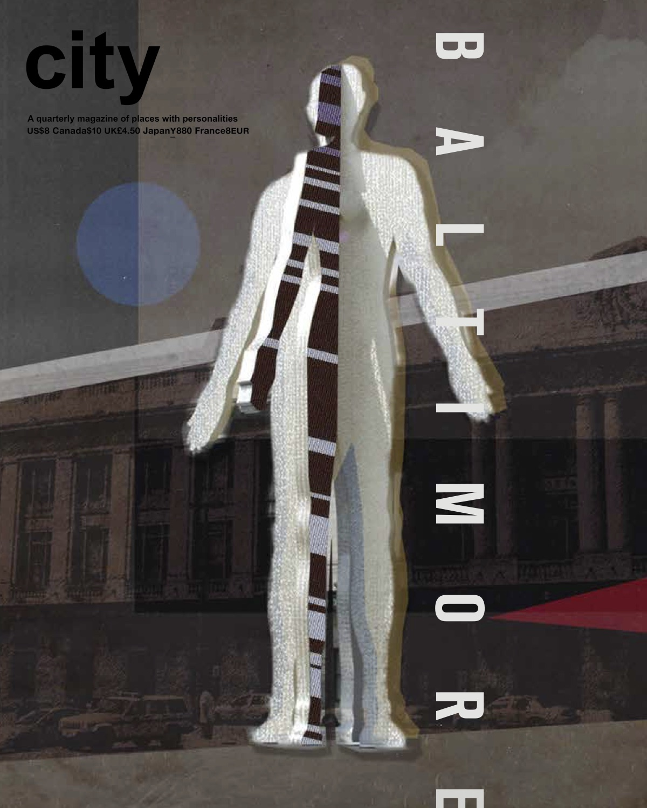

import React from 'react';
import { merge } from "theme-ui"
import { Box, Heading, Flex, Image} from 'rebass';

<Text sx={{  fontSize: [4, 5, 6], fontWeight: `bold`, color: `heading` }}>
  Hey there!
</Text>

MDX using imported components!

<Box>
  <Heading>Here’s a heading</Heading>
</Box>

> ”This is an important quote.”

<Flex>
  <Box
    p={3}
    width={1/2}
    color='black'
    bg='pink'>
    Flex
  </Box>
  <Box
    p={3}
    width={1/2}
    color='black'
    bg='grey'>
    Box
  </Box>
</Flex>

<Box  
  my = {3} 
  p = {3} 
  bg = 'grey' 
  color='black'
  maxWidth={[ '100%', '50%', '25%' ]} >
  RESPONSIVE
</Box>


<Box
  sx={{
    ul: {
      listStyle: 'none',
      display: 'grid',
      padding: 0,
      gridGap: 3,
      gridTemplateColumns: 'repeat(auto-fit, minmax(128px, 1fr))',
    },
    li: {
      fontWeight: 'bold',
    }
  }}>
- This is a list
- Displayed in a grid layout
- With custom styles
- Pretty cool, huh?
</Box>


<div style={{padding: '1rem', margin: '5rem 0rem 5rem 0rem', border: '1px dashed tomato', borderColor: 'tomato'}}>
  Try and change the border color to `tomato`.
</div>


<Grid width={[128, null, 192]}>
  <Box bg="white">Box</Box>
  <Box bg="tomato">Box</Box>
  <Box bg="blue">Box</Box>
  <Box bg="yellow">Box</Box>
</Grid>



I was born and raised in Baltimore, MD. New York is where I live currently, but Baltimore will always be home.

When I'm not designing or developing, I enjoy reading (especially philosophy), writing, drawing, and watching movies.

My American Media studies concentration sythesized classes in American Studies, Media Studies, Philosophy, and Design. During undergrad, I was particularly interested in semiotics (the study of meaning-making) and propaganda studies. I also took classes in Computer Science and Web Development.

<Message>This is just a message for someone to read</Message>

Some `backticks` for inline.

```js
backtick.fences('for blocks')
```

[MDX](https://mdxjs.com "title")

A backslash\
before a line break…

Some *asterisks* for emphasis.

# One number sign…
## One number sign…
### One number sign…
#### One number sign…
##### One number sign…
###### One number sign…

Three asterisks for a thematic break:

***


* asterisks for unordered items

1. decimals and a dot for ordered items

1. decimals and a dot for ordered

```js
backtick.fences('for blocks')
```

Two **asterisks** for strong.

***

export const Highlight = ({children, color}) => (
  <span
    style={{
      backgroundColor: color,
      borderRadius: '2px',
      color: '#fff',
      padding: '0.2rem',
    }}>
    {children}
  </span>
);

<Highlight color="#25c2a0">Docusaurus green</Highlight> and <Highlight color="#1877F2">Facebook blue</Highlight> are my favorite colors.

I can write **Markdown** alongside my _JSX_!

### Here is a table

<table>
  <tr>
    <th>Company</th>
    <th>Contact</th>
    <th>Country</th>
  </tr>
  <tr>
    <td>Alfreds Futterkiste</td>
    <td>Maria Anders</td>
    <td>Germany</td>
  </tr>
  <tr>
    <td>Centro comercial Moctezuma</td>
    <td>Francisco Chang</td>
    <td>Mexico</td>
  </tr>
  <tr>
    <td>Ernst Handel</td>
    <td>Roland Mendel</td>
    <td>Austria</td>
  </tr>
  <tr>
    <td>Island Trading</td>
    <td>Helen Bennett</td>
    <td>UK</td>
  </tr>
  <tr>
    <td>Laughing Bacchus Winecellars</td>
    <td>Yoshi Tannamuri</td>
    <td>Canada</td>
  </tr>
  <tr>
    <td>Magazzini Alimentari Riuniti</td>
    <td>Giovanni Rovelli</td>
    <td>Italy</td>
  </tr>
</table>