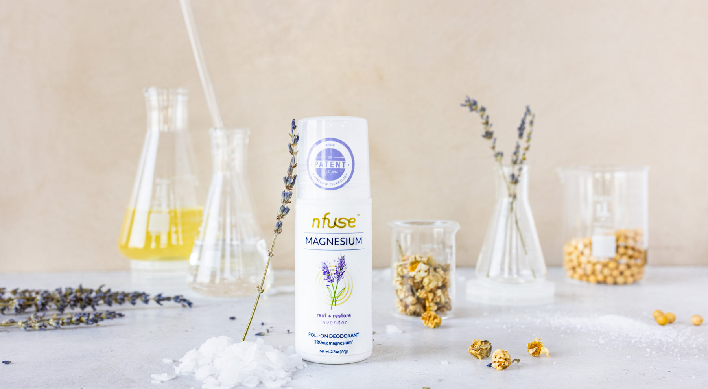

import { Embed, Box, AspectImage } from 'theme-ui'
import Photo from "./lav-deodorant.jpg"
import { StaticImage } from "gatsby-plugin-image"

<StaticImage src="./lav-deodorant.jpg" alt="A dinosaur" />

<Box sx={{mx: [3, 4, 5], my: 5}}> 
  
nfuse LLC is a bodycare company that specializes in magnesium-based products, implementing a patented transdermal delivery system.

  
Beginning in 2016, I've been responsible for the company's branding and package design. Today, nfuse products are sold at over 1,000 stores around the United States, including CVS and Whole Foods.

  
<a target="_blank" rel="noopener noreferrer" href="https://www.nfusemagnesium.com"
  >Click here to see their website &#8594;</a>

</Box>

<Box sx={{mx: [4, 5]}}>
  <Embed sx={{ mb: [4, 5, 5, 5] }} src="https://www.youtube.com/embed/AlfB2oaoVrs" />
</Box>

<!--[&#x2190; Back to projects page](/projects)-->
